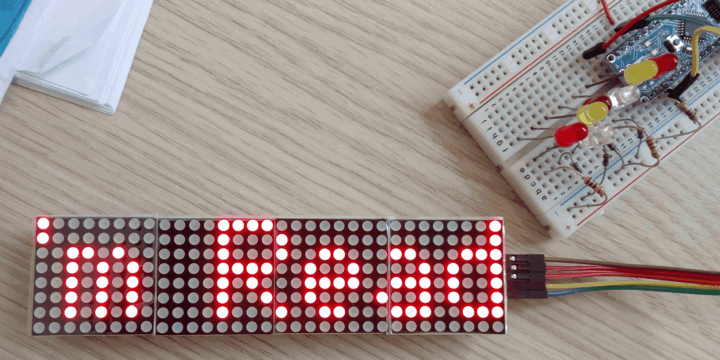

# Arduino Greetings Scroller using MAX7219 LED matrix modules

This is an implemenation of a simple sideways scroller showing a
randomly selected seasonal greeting, using an Arduino nano and MAX7219
LED matrix modules.

The application was written as a gift, but it may be of interest to
others, so here goes..

## Wiring

Wiring is very simple:

| Arduino | MAX7219  |
|---------|----------|
| Vcc     | Vcc      |
| Gnd     | Gnd      |
| 10      | CS       |
| 11      | CLK      |
| 12      | MOSI     |

# Software

Adjust the DEVICES and REVERSE_ORDER defines to match the number of
MAX7219's you have in series and their X-coordinate mapping. You can
also tweak SCROLL_DELAY if you are not happy with the scroll speed.

The font comes from [Espruino](https://www.espruino.com), which gets
converted into a simple format by [font2h.py](font2h.py). The messages
comes from [msgs.txt](msgs.txt) which likewise gets converted into
PROGMEM strings by [msgs2h.py](msgs2h.py).

A framebuffer is maintained in RAM, and the entire screen is refreshed
for each update.

## Building

[Arduino-Makefile](https://github.com/sudar/Arduino-Makefile) is used
to build the application. Python (2.x) is needed for the conversion
scripts.
